# Google API Credentials Setup Instructions

`gtm-tools` needs credentials of a Google Cloud [Service
Account](https://cloud.google.com/iam/docs/service-account-overview) with access
to [Tag Manager
APIs](https://developers.google.com/tag-platform/tag-manager/api/v2) to work.
Follow the instructions to setup a Service Account with proper accesses.

## Create a Service Account and get credentials

### Create a [Service Account](https://console.cloud.google.com/projectselector2/iam-admin/serviceaccounts)

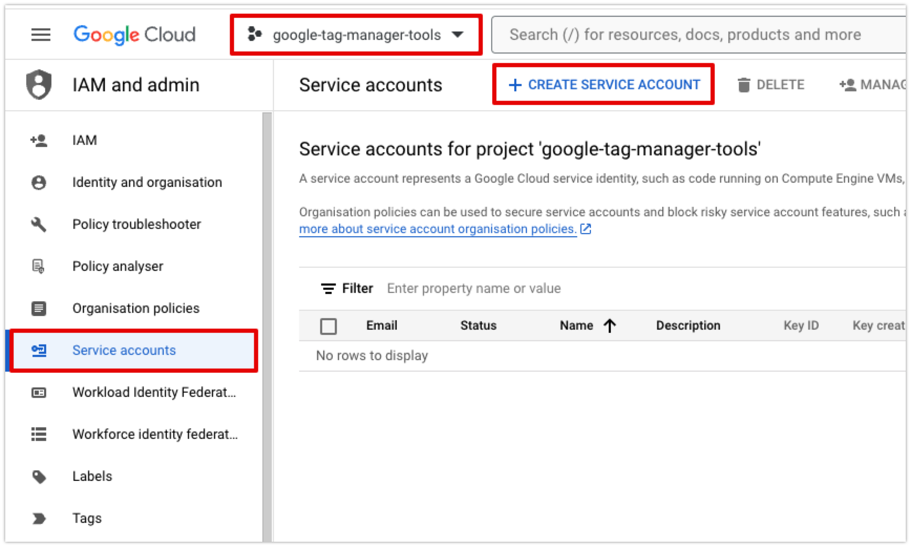

### Create a Project (if it does not exists)

Credentials are created under a project. If you don't have an existing project
that you can use, create a new project.

### Create a new Service Account and download credentials

1. Give your Service Account a name:
   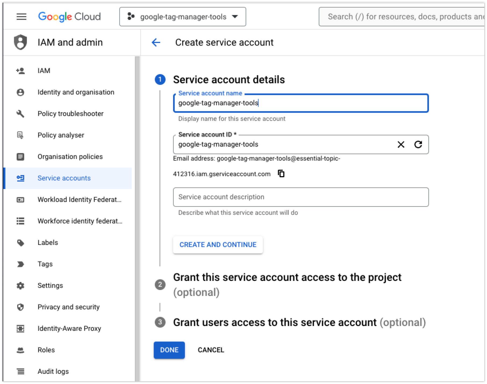
2. Continue the optional 2nd and 3rd steps to create the service account.
3. You will see your new service account in the dashboard.
   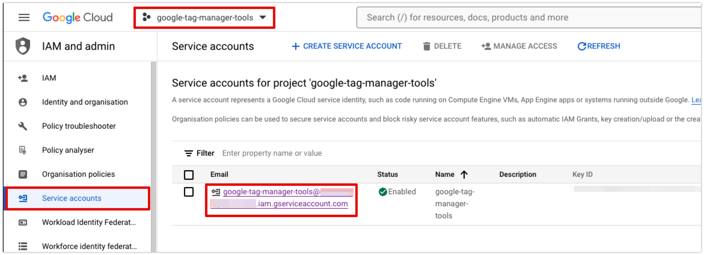
4. Generate a new Key for your service account. Select `JSON` format for the key:
   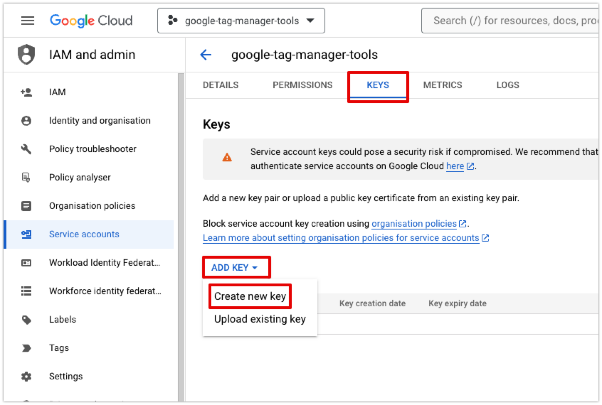
5. Your new key will be downloaded as a JSON file. Store it carefully.

## Enable Tag Manager API for your project

Once you have your Service Account ready, you will need to enable Tag Manager
API for your project.

1. Head over to `APIs and services` section in Google Cloud Console.
   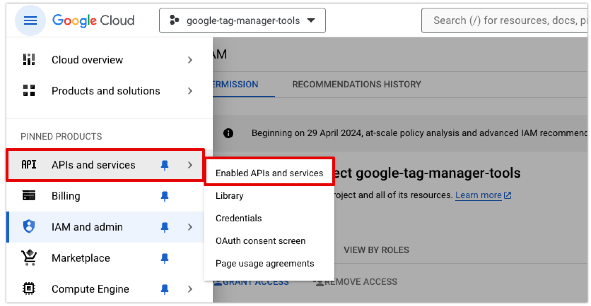
2. Click on `ENABLE APIS AND SERVICES`.
   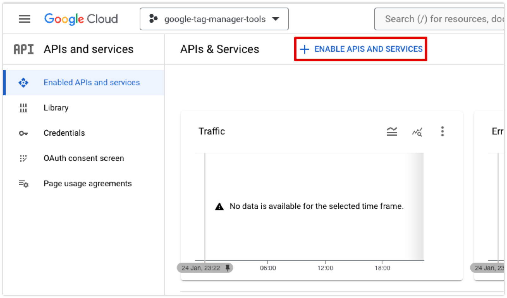
3. Search for `Tag Manager`to find the option for Tag Manager API. Then click it
   and enable it for this project.
   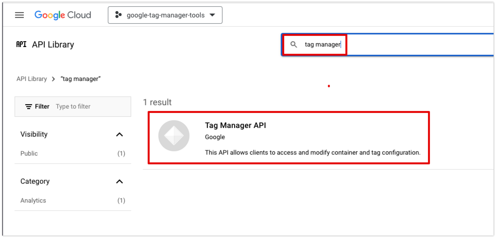

## Give the Service Account access to work with your Google Tag Manager accounts

You have created a Google Cloud project with access to Tag Manager API, you have
created a Service Account under that project and you have downloaded the
credentials for this Service Account.

Service Accounts are sort of like regular users. They are meant only to be used
for programmatic API access to services instead of using them to login a web
application like a regular user. So just like regular users need to be given
access to work with a Google Tag Manager account, Service Accounts also need to
be given access to them for API access.

1. Login to Google Tag Manager web console and head over to [accounts list](https://tagmanager.google.com/).
2. Open Admin Settings for one of your accounts.
   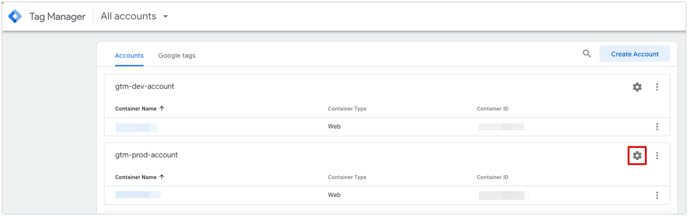
3. Go to User Management.
   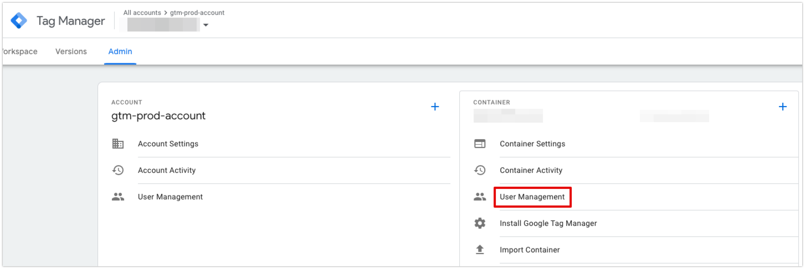
4. Click on the `+` button to add a new user.
   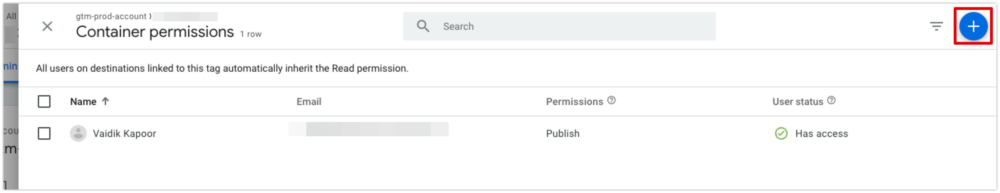
5. Copy the **email address** for your Service Account from the list of service
   accounts on Google Cloud console.
   
6. Under **Email addresses**, add the email address for your service account.
   Then select the right permissions. If you want to use all the features of
   `gtm-tools`, you need to give this **user all the permissions**. Then invite
   this user.
   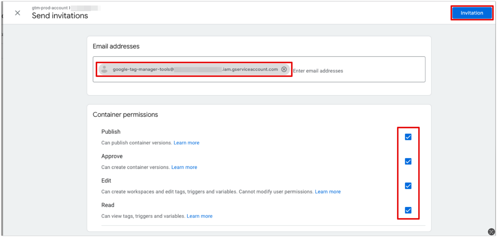

This is it! Your account and service account credentials are now configured to
be used with `google-tag-manager-tools.`